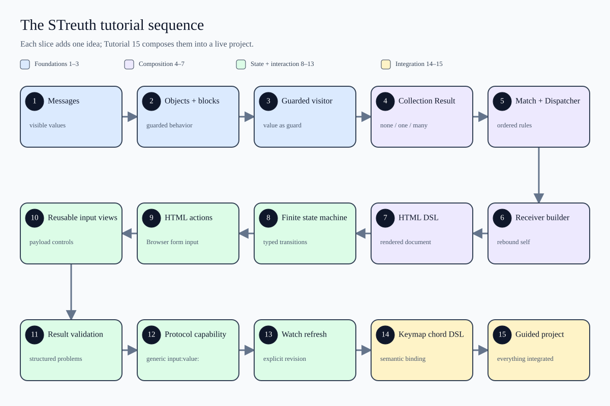

# 15 — ChordBuilder guided project

This project is the integration point for the tutorial sequence. It uses the
canonical Workspace ChordBuilder rather than recreating a simplified copy, and
drives it through the same HTML-action boundary used by STreuthBrowser.



`TutorialSequence.st` is the source of this diagram. Running that file writes
the checked-in SVG beside it and displays the same image in STreuthBrowser's SVG
pane. Select the SVG tab before opening Presentation Layout to keep the live
diagram beside the source; select HTML instead to present the interactive chord
builder.

Run it from the repository root:

```sh
./bin/run-example 15_chord_builder_guided_project
```

Expected output:

```text
Rendered the 15-slice tutorial map in the SVG pane.
Cmd+k
State: Done
Chord: Cmd+k
Inputs processed: 4
Rendered a fresh interactive chord builder in the HTML pane.
```

The diagram line is produced by `TutorialSequence.st`; the following `Cmd+k` is
printed by the canonical FSM when it enters `Done`. In
STreuthBrowser, the final line corresponds to a fresh interactive view: choose
one or more modifiers, optionally use Delete, then send one character.

## Follow the data

The project deliberately crosses every boundary introduced by Tutorials
08–14:

1. `ModifierKey` and `ChordBuilderInput` are Enums, so both the input kind and
   modifier payload are domain values rather than arbitrary strings.
2. `FSMInputView` renders the Modifier select and Character field. Their
   handlers translate submitted fields into typed `input:value:` messages.
3. `FSMValueInputProtocol` states the capability those handlers require without
   coupling them to `ChordBuilderFSM`.
4. The FSM decides when inputs are legal. Its `Collecting` state uses the
   builder's `Result` cardinality: Delete returns to `Empty` when one modifier
   remains, or removes the latest modifier and stays put when there are many.
5. `ChordBuilder` owns chord accumulation and exposes the presentation-friendly
   `chordText` through delegation.
6. `FsmHtmlApp follow:` watches `inputRevision`, so the HTML view redraws after
   each processed input while retaining one subscription.
7. The HTML DSL renders the state summary, custom controls, default payload-free
   actions, and transition table without JavaScript.

The executable path sends `Cmd`, then `Shift`, then the payload-free `Delete`,
then `k`. Assertions prove that Delete takes the Result-aware “many modifiers”
branch, leaving `Cmd` for the terminal character. The rendered-document checks
also prove that custom and default input views coexist in one application.

## Explore it in the IDE

Open this tutorial's `.streuth-workset.st` in STreuthBrowser and run the
workset. The HTML pane should finish on a fresh machine in `Empty`. The Modifier
and Character inputs are forms because they carry payloads; Delete and Escape
are ordinary action links because they do not.

While interacting, inspect `liveMachine` in Object Browser. `currentState`,
`chordText`, and `inputRevision` should change together after each accepted
action. The HTML pane follows the same live object through its Watch.

Try `Cmd`, `Shift`, Delete, then `k`. The machine should finish with `Cmd+k`.
Run the workset again to create a clean machine rather than mutating the
tutorial source or introducing a serialized intermediary format.

STreuth documentation © 2026 Mark Kimberly Howe, licensed under CC BY-SA 4.0.
